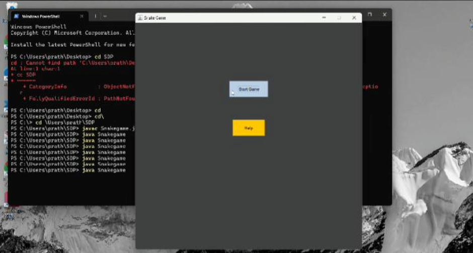
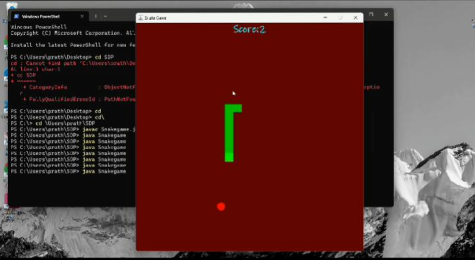
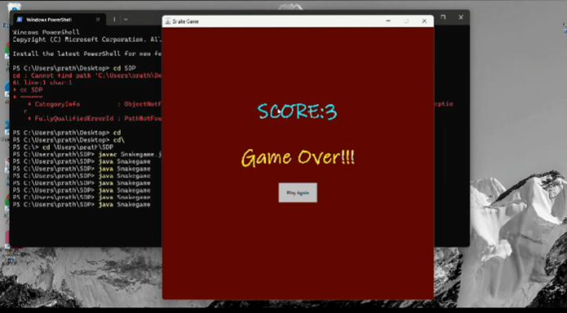

# 🐍 Classic Snake Game in Java

[](https://www.oracle.com/java/)
[](https://docs.oracle.com/javase/tutorial/uiswing/)

A lightweight, pixel-perfect 2D Snake Game engineered from scratch utilizing native **Java Swing** and **AWT** components. Featuring an integrated state-driven menu manager, dynamic collision-evaluation loops, and focus-safe button handling for instant replays.

---

## 📸 Game Previews

Here is a look at the game interfaces built entirely with Java Swing:

### 1. Main Menu Screen
An introductory window featuring options to jump straight into the action or review gameplay instructions.

<p align="center">
  
</p>

### 2. Active Gameplay
Smooth, 60FPS grid movement displaying the active snake length tracking toward food targets with live score updates.

<p align="center">
  
</p>

### 3. Game Over & Replay Screen
Triggers instantly on boundary or self-collisions, showcasing final performance metrics along with a responsive replay button.

<p align="center">
  
</p>

---

## 🎨 Features At A Glance

* **Interactive State Router (`Page1.java`)**: A dedicated splash context featuring explicit navigation flows into gameplay configurations or localized context help modals.
* **AWT Dialog Interception**: Leverages declarative informational overlays for real-time control walkthroughs without triggering window bloat.
* **Focus-Resilient UI Pipeline**: Custom button state management overrides focus stealing, allowing instant transitions back to active keyboard event reading loops.
* **Session-Persistent High Scores**: Real-time score compilation structures that accurately cache performance milestones across subsequent loops within a runtime session.

---

## 🛠️ System Architecture

The game decouples window environments from behavioral contexts using a micro-modular layout configuration:

```text
📁 snake-game/
│
├── 📁 screenshots/    # Place your image_6fee77.jpg, etc. here!
├── 📄 Snakegame.java  # Application Entry Context
├── 📄 Page1.java      # Splash & Navigation Canvas Environment 
├── 📄 Gameframe.java  # Native OS-Level Window Container Context
└── 📄 Gamepanel.java  # Collision Loop & Graphics Rendering Pipeline

```

---

## 🚀 Getting Started & Compilation

### Building via Terminal

Navigate to the root directory where your source `.java` files are located, then execute the following directives:

1. **Compile all compilation units simultaneously:**
```bash
javac Snakegame.java Page1.java Gameframe.java Gamepanel.java

```


2. **Launch the runtime execution thread:**
```bash
java Snakegame

```


---

## 🕹️ Controls & Mechanics Reference

| Action / Direction | Input Mapping | Rule / Event Boundary |
| --- | --- | --- |
| **Steer Up / Down** | ⬆️ / ⬇️ Arrows | Cannot steer directly backward into opposing vectors. |
| **Steer Left / Right** | ⬅️ / ➡️ Arrows | Cannot steer directly backward into opposing vectors. |
| **Consume Apple** | Automatic Intersection | Extends body index by `1` cell; increments score by `1`. |
| **Hit Boundary / Self** | Automatic Collision | Drops running flags, halts the active timer, and outputs Game Over metrics. |
